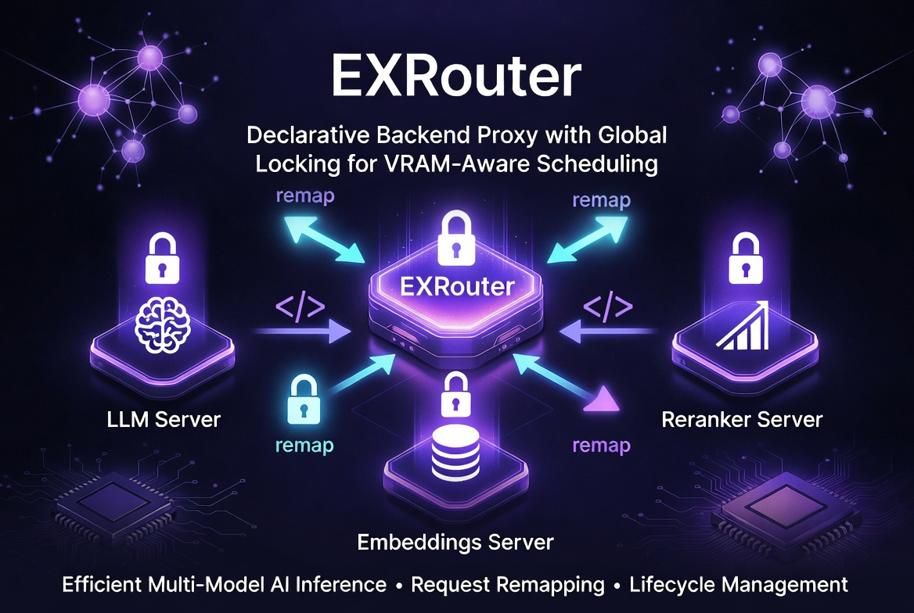

# EXRouter - Exclusive Router v1.1.0

A declarative backend proxy with **global locking for VRAM/resource-aware scheduling** and request remapping. Routes requests to configured backends and manages cross-backend exclusive locks to enable efficient hardware utilization.



## Purpose

EXRouter solves the common problem of having **separate backends** for different AI capabilities while providing a single, clean API in front of them.

**One of EXRouter's core innovations is its global locking system**, purpose-built to enable **reuse of limited VRAM (and other scarce resources)** across multiple GPU-accelerated AI services. 

Instead of requiring all models to be loaded simultaneously (quickly exhausting GPU memory), you declaratively specify which backends contend for resources. EXRouter then enforces exclusive access with proper re-entrancy, timeouts, and high concurrency for non-conflicting operations. Combined with lifecycle hooks, this pattern supports advanced setups such as on-demand model loading/unloading while maintaining a unified API.

It supports advanced routing needs through **request remapping** and **domain-based virtual hosting**, allowing you to expose TEI-style endpoints, rewrite paths, run multiple services on different subdomains through a single instance, and more — all declaratively, without requiring a fronting reverse proxy.

## Key Features

- **Declarative Backend Configuration**: Define backends in YAML with paths and locks
- **Global Locking for VRAM Reuse (Core Innovation)**: Backends declare locks on other backends; EXRouter enforces mutually exclusive access for resource-contending operations while allowing full concurrency within the same backend. This is a key innovation for running rich multi-model setups on hardware with limited VRAM. Includes re-entrancy, configurable timeouts (`503 + Retry-After`), and seamless integration with lifecycle hooks.
- **Request Remapping**: Per-backend Python scripts that can rewrite paths, fix request bodies, switch backends, or short-circuit responses
- **TEI Compatibility**: Easily expose TEI-style endpoints (`/v1/embed`, `/v1/info`) on top of `llama-server --embeddings`
- **Connection Pooling**: Shared `httpx` client for efficient connections
- **Streaming Support**: SSE and regular responses streamed without buffering
- **Timeout Handling**: Configurable lock timeouts with `503 + Retry-After`
- **Hop-by-Hop Header Filtering**: Proper HTTP proxy behavior
- **Lifecycle Management**: Declarative `lifecycle:` blocks to manage a backend's own service (systemd, shell, wait_for). Automatically stops conflicting locked backends on activation. Backends with `locks:` stay running until another conflicting backend activates. Can be combined with custom Python hooks.
- **Domain-based Routing & Virtual Hosting**: Optional `domain:` field (supports wildcards). EXRouter can now function as a lightweight reverse proxy / virtual host router without needing Caddy, Nginx or Traefik in front. When a request's `Host` header matches any declared domain, only domain-declaring backends are considered. Multiple backends can share the same domain but serve different paths. Pure path-based backends are automatically skipped in domain-matched requests. Proper `X-Forwarded-*` headers and compression handling are included.
- **WebSocket Proxy Support**: Automatic WebSocket upgrade handling with proper header forwarding
- **Health & Config Endpoints**: Built-in `/health` and `/config` endpoints for monitoring
- **Environment Configuration**: Server bind address configurable via `EXROUTER_HOST` and `EXROUTER_PORT`
- **Error Propagation**: Backend HTTP status codes are forwarded correctly

## Architecture

```
                     ┌─────────────────────────────┐
                     │         EXRouter            │
                     │   (FastAPI on :4001)        │
                     └──────────────┬──────────────┘
                                    │
          ┌─────────────────────────┼─────────────────────────┐
          │                         │                         │
          ▼                         ▼                         ▼
   ┌──────────────┐        ┌────────────────┐        ┌──────────────┐
   │  LLM Server  │        │ Embeddings     │        │ Reranker     │
   │  (llama.cpp) │        │ Server         │        │ Server       │
   │   :8080      │        │   :8081        │        │   :8082      │
   └──────────────┘        └────────────────┘        └──────────────┘
   /v1/chat/*             /v1/embeddings           /v1/rerank
   locks: [embed]         locks: [llm]             locks: [llm, embed]
```

**Resource Coordination via Locks**  
The `locks:` declarations in the example above are the heart of the VRAM-reuse innovation: the reranker will wait for both LLM and embeddings backends to be free before processing, preventing VRAM contention. LLM waits for embeddings, etc. Multiple requests to the *same* backend run concurrently without blocking.

## Quick Start

```bash
cd /src/exrouter
uv sync

# Edit config.yaml or use your own
uv run python -m exrouter.main -c /path/to/config.yaml
```

## Configuration

All configuration is done through YAML.

**Important terminology distinction:**
- **Lock domain**: A group of backends that can lock each other (YAML hierarchy level)
- **Routing domain**: A `Host` header pattern a backend handles (the `domain:` field in backend config)

### Config Structure

```yaml
server:
  host: 0.0.0.0
  port: 4001

global_lock:
  enabled: true
  timeout: 300

# Top-level "backends" key contains LOCK DOMAINS
# Each lock domain contains backends that can lock each other
backends:
  compute:  # ← LOCK DOMAIN name
    llm:    # ← backend name (directly under lock domain)
      url: http://127.0.0.1:8080
      paths:
        - /v1/chat/completions
        - /v1/completions
        - /v1/models
      locks:
        - embed  # locks other backends in SAME lock domain
    
    embed:   # ← another backend in same lock domain
      url: http://127.0.0.1:8081
      paths:
        - /v1/embeddings
        - /v1/embed
        - /v1/info
      remapper: /path/to/tei_remapper.py
      locks: []
```

### Backend Configuration

Each backend specifies:

- `url`: Backend server URL (must be http/https)
- `paths`: List of path patterns (supports wildcards like `/v1/vision/*`)
- `locks`: List of other backend names to **exclusively lock** while processing. Must be in the same lock domain. This is the mechanism for declaring VRAM/resource contention.
- `script` (optional): Path to Python hook script for lifecycle callbacks (e.g. dynamic model load/unload)
- `remapper` (optional): Path to Python request remapper script
- `domain` (optional): List of domain / `Host` header patterns this backend handles (supports `fnmatch` wildcards like `*.example.com` or exact names). When present, **both** domain and path must match. If the incoming request's `Host` matches any backend's declared domain, only domain-declaring backends are eligible — pure path-based backends are skipped. This turns EXRouter into a capable reverse proxy / virtual host router.
- `lifecycle` (optional): Declarative lifecycle actions (systemd + shell + wait_for) on activate/deactivate

### Lock Domains

Backends are organized into **lock domains** (the first-level keys under `backends:`). Each lock domain is an independent group where backends can lock each other:

```yaml
backends:
  compute:  # Lock domain 1 - GPU compute backends
    llm:
      url: http://localhost:8080
      locks: [embed]
    embed:
      url: http://localhost:8081
      locks: []
  
  audio:  # Lock domain 2 - Audio processing backends
    stt:
      url: http://localhost:7301
      locks: [tts]
    tts:
      url: http://localhost:7302
      locks: []
```

Backends in `compute` lock domain can only lock other backends in `compute`. Backends in `audio` can only lock backends in `audio`. Cross-domain locks are not allowed.

### Domain-based Routing & Virtual Hosting

EXRouter supports **routing domains** via the `domain:` field in backend config. This allows you to run multiple services on different subdomains through a single EXRouter instance — without needing an extra reverse proxy (Caddy/Nginx/Traefik) in front.

**How it works:**
- Add `domain:` to a backend (string or list of domain patterns)
- A request is routed to a backend only if **both** the `Host` header matches one of its domains **and** the path matches one of its `paths`
- If the request's `Host` matches any declared domain in the config, pure path-only backends (backends without `domain:` set) are automatically ignored
- Multiple backends can share the same domain but use different path patterns
- Use `paths: ["*"]` (recommended) or `paths: ["/"]` for backends that should own the entire domain/subdomain

**Example config with virtual hosting:**

```yaml
backends:
  frontend:  # Lock domain for frontend services
    open-webui:
      url: http://127.0.0.1:9090
      domain: ["openwebui.unnsvc.org"]
      paths: ["*"]  # Owns entire domain
    
    hermes-dashboard:
      url: http://127.0.0.1:9119
      domain: ["dashboard.unnsvc.org"]
      paths: ["*"]
    
    langfuse:
      url: http://127.0.0.1:7509
      domain: ["langfuse.unnsvc.org"]
      paths: ["*"]
  
  compute:  # Lock domain for GPU backends (no routing domain = path-only)
    llm:
      url: http://127.0.0.1:8080
      paths:
        - /v1/chat/completions
        - /v1/completions
      locks: [embed]
    
    embed:
      url: http://127.0.0.1:8081
      paths:
        - /v1/embeddings
      locks: []
```

With this setup you can access:
- `https://openwebui.unnsvc.org/` → open-webui (domain match)
- `https://dashboard.unnsvc.org/` → hermes-dashboard (domain match)
- `https://langfuse.unnsvc.org/` → langfuse (domain match)
- `http://127.0.0.1:4001/v1/chat/completions` → llm (path-only, no domain match)
- `http://127.0.0.1:4001/v1/embeddings` → embed (path-only, no domain match)

EXRouter also sets proper reverse proxy headers (`X-Forwarded-For`, `X-Forwarded-Host`, `X-Forwarded-Proto`, `X-Real-IP`) and handles compression transparently.

### Declarative Lifecycle Management

EXRouter supports declarative lifecycle management via the `lifecycle:` key under each backend. This is the recommended way to start, stop, and wait for backend services (especially when using systemd).

Example:

```yaml
backends:
  compute:
    llm:
      url: http://127.0.0.1:8080
      paths: [/v1/chat/completions]
      locks: [stt]
      lifecycle:
        on_activate:
          systemd:
            start: [llama-server.service]
          wait_for:
            - type: port
              host: 127.0.0.1
              port: 8080
              timeout: 30
        on_deactivate:
          systemd:
            stop: [llama-server.service]
```

**Important rules and behavior:**

- The `on_activate` and `on_deactivate` actions defined for a backend are **only intended to manage that backend's own service**. Do **not** use them to manually start or stop *other* services. Doing so can cause race conditions and nasty locking issues.
- When a backend activates, EXRouter **automatically** stops any backends listed in its `locks:` array (by calling their `on_deactivate`) *before* running the current backend's `on_activate`.
- Backends that declare `locks:` **stay running** once activated. They are **not** automatically stopped when their request count reaches zero. They only get stopped when another backend that conflicts with them activates.
- This design gives you clean "mode switching" behavior between mutually exclusive heavy services (e.g. LLM ↔ Speech-to-Text) while keeping the previously active service warm.

You can combine `lifecycle:` with custom Python hook scripts (`script:`) if you need more complex logic.

### Request Remappers

Request remappers allow you to intercept and transform requests **before** they reach a backend. This is powerful for API compatibility.

Create a Python file that defines a `RequestRemapper` class:

```python
from exrouter.remapper import RequestRemapper, RemapResult
from exrouter.hooks import HookContext
import json

class RequestRemapper:
    async def remap(self, context: HookContext) -> RemapResult | None:
        path = context.request_path.lower()

        if path == "/v1/info":
            return RemapResult(
                status_code=200,
                content=json.dumps({"model_id": "my-model"}).encode(),
                response_headers={"content-type": "application/json"}
            )

        if path == "/v1/embed":
            # Rewrite path and fix body format
            data = json.loads(context.request_body or b"{}")
            if "inputs" in data:
                data["input"] = data.pop("inputs")

            return RemapResult(path="/v1/embeddings", body=json.dumps(data).encode())

        return None
```

Remappers can:
- Rewrite the request path
- Change the target backend
- Modify headers and body
- Return a direct response (short-circuit)

### Hook Scripts

Hook scripts allow custom code to run at specific points in the request lifecycle or backend lifecycle. This pairs powerfully with global locking for advanced VRAM management (e.g. starting/stopping backends or loading/unloading models on demand).

Create a Python file that defines a `BackendHook` class:

```python
from exrouter.hooks import BackendHook, HookContext

class BackendHook:
    def on_backend_activated(self, context: HookContext) -> None:
        print(f"Backend {context.backend_name} activated")

    def on_backend_deactivated(self, context: HookContext) -> None:
        print(f"Backend {context.backend_name} deactivated")

    # Other lifecycle methods available...
```

### Global Lock Settings

- `enabled`: Whether locking is active
- `timeout`: Seconds to wait for locks (returns 503 if exceeded)

### Environment Variables

Server configuration can be overridden via environment variables:

- `EXROUTER_HOST`: Host to bind to (default: `0.0.0.0`)
- `EXROUTER_PORT`: Port to listen on (default: `4001`)

Example:
```bash
EXROUTER_HOST=127.0.0.1 EXROUTER_PORT=8080 uv run python -m exrouter.main
```

## How Locking Works

**Global locking is one of EXRouter's primary innovations.** It turns limited VRAM (and similar hardware resources) into a first-class, declaratively managed concern rather than an afterthought.

In typical multi-backend AI deployments, you quickly run into VRAM limits: you cannot keep every LLM, embedding model, reranker, vision model, etc. resident in GPU memory at once. EXRouter solves this by letting you *declare* resource contention relationships in YAML. The router then automatically serializes access to conflicting backends while preserving maximum concurrency everywhere else.

**How it achieves VRAM reuse:**
- When a request arrives for a backend, EXRouter acquires exclusive locks on all backends listed in its `locks:` array (and waits if necessary).
- Only after all required locks are held does the request proceed to the backend.
- Locks are held for the *entire duration* of the request (including full streaming responses).
- Multiple in-flight requests to the **same** backend share the lock and never block each other.
- Requests to **different** backends that declare mutual or overlapping locks will queue naturally.

This design lets you safely run many more AI capabilities on a single GPU than would otherwise be possible, often in combination with lifecycle hooks that dynamically load or unload models.

**Key Rules:**
- Multiple concurrent requests to the *same* backend never block each other.
- A request to a *different* backend will wait if it tries to acquire a target currently held by another backend.
- Locks are released only after the request finishes (including streaming).
- Timeouts are configurable per `global_lock.timeout` and return clean `503 Service Unavailable` + `Retry-After` headers.

**Example from the Architecture diagram**  
- LLM declares `locks: [embed]` → LLM inference waits for any embedding work to finish (freeing VRAM).
- Reranker declares `locks: [llm, embed]` → Reranking (often memory-heavy) waits for both LLM and embeddings to be idle.
- Embeddings declares no locks → it can run whenever LLM is not using it.

The result: predictable, efficient VRAM sharing without complex custom orchestration code.

## Response Handling

- **SSE (Server-Sent Events)**: Streamed line-by-line
- **Regular responses**: Streamed byte-by-byte
- **WebSocket**: Automatically upgraded and proxied with proper headers
- Backend HTTP status codes (including 4xx and 5xx) are forwarded correctly

## Endpoints

EXRouter exposes the following built-in endpoints:

- `/health`: Health check endpoint (returns 200 OK if server is running)
- `/config`: Returns current configuration as JSON (useful for debugging and monitoring)
- All other paths are routed to configured backends

## Testing

```bash
uv run pytest tests/ -v
```

## Deployment (systemd)

Example service file:

```ini
[Unit]
Description=EXRouter - Exclusive Router
After=network.target

[Service]
Type=simple
User=noname
WorkingDirectory=/src/exrouter
ExecStart=/src/exrouter/.venv/bin/python -m exrouter.main -c /src/exrouter/config.yaml
Restart=always

[Install]
WantedBy=multi-user.target
```

## Design Philosophy

- **Transparency**: EXRouter tries to be invisible — status codes and streaming are preserved
- **Declarative**: All configuration lives in YAML (including complex resource locking rules)
- **Resource-Aware by Design**: Global locking makes VRAM contention a first-class declarative primitive instead of something you solve with custom scripts or external orchestrators
- **Extensible**: Remappers and hooks allow deep customization without changing core logic
- **Efficient**: Connection pooling and streaming minimize resource usage

## License

Apache License 2.0